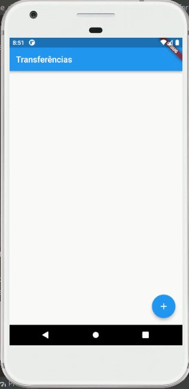

# byte_bank_app

A simple app to register financial transactions.

## What was used?
[x] Flutter  
[x] Material components  
[x] Stateless and Stateful widgets

## This app was made from a Alura's course
Access the course [here](https://cursos.alura.com.br/course/flutter-fundamentos)

## App functionality
